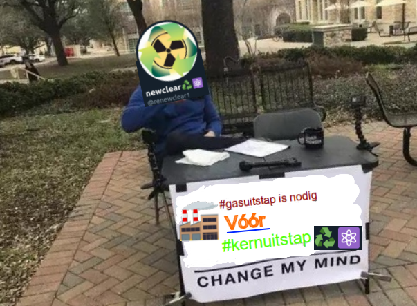

# Gasuitstap

In dit korte overzichtsdocument neem ik je even kort mee in de redenering die ik al enige tijd maak.
Ik maak me al lang zorgen over het #klimaat tegenwoordig iedereen zowat (zelfs Big Oil probeert hun imago te #greenwashen) maar in de jaren 90 ik ook al!
Ik heb vele jaren gestreden om het mee op de agenda te zetten maar nu het EINDELIJK op de agenda lijkt te staan zie ik heel wat gebeuren waar ik me zorgen over maak.

De recente regeringsformatie culmineerde voor mij in m'n zorg over de #kernuitstap.
In de formatienota staat namelijk in deze paragraaf welgeteld één zin (de enige over 'kernengerie', trust me I checked):

> "De omslag naar een koolstofvrije economie zal een
> voortdurende zorg van de regering zijn. In de eerste
> plaats zetten we in op de ontwikkeling en bouw van
> hernieuwbare energiebronnen – in het bijzonder
> wind- en zonne-energie – en dit in het hele land 
> van Oostende tot Aarlen. Hernieuwbare energie en
> efficiënter energiegebruik moeten geleidelijk aan
> vervuilende energiebronnen, met inbegrip van
> kernenergie, vervangen."

(or don't trust me and read it yourself [dutch][french] [here](http://newsroom.roularta.be/static/30092020/RegeerakkoordDeCroo.pdf))

Vandaag nog tweete ik dit. Waarom? Om even aan te tonen hoe vervuilend zowel #gas als #biomassa wel is.
 
https://twitter.com/renewclear1/status/1311674763748704258

Verder deel ik graag even deze statistiek van onze wereldwijde, sterk stijgend energievraag:

Zoals je ziet nog heel wat #fossiel in aanwezig. De cijfers liegen er niet om: 85%! VIJFENTACHTIG PROCENT!

Als je met dit alles in het achterhoofd ECHT overtuigd bent dat we #gascentrales moeten bijzetten i.p.v. een #gasuitstap. Dan mag je mij, a.u.b. serieus, proberen overtuigen.

Op twitter, op email renewcler of op reddit. Ik spreek vloeiend english en nederlands (en helaas nog steeds vloeibaar Le français). 
In deze COVID tijden bij deze dus een digitale "Debate me" een warme uitnodiging om me het vuur a.d. schenen te leggen in een publiek forum.
(Als je me mailt i.f.v. deze challenge weet dan dat ik het debat wel wel op andere plekken ga publiceren). 

Klimaatvriendelijke Groet,
@renewclear1
